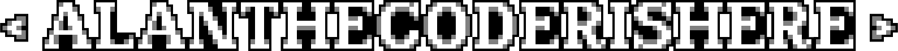
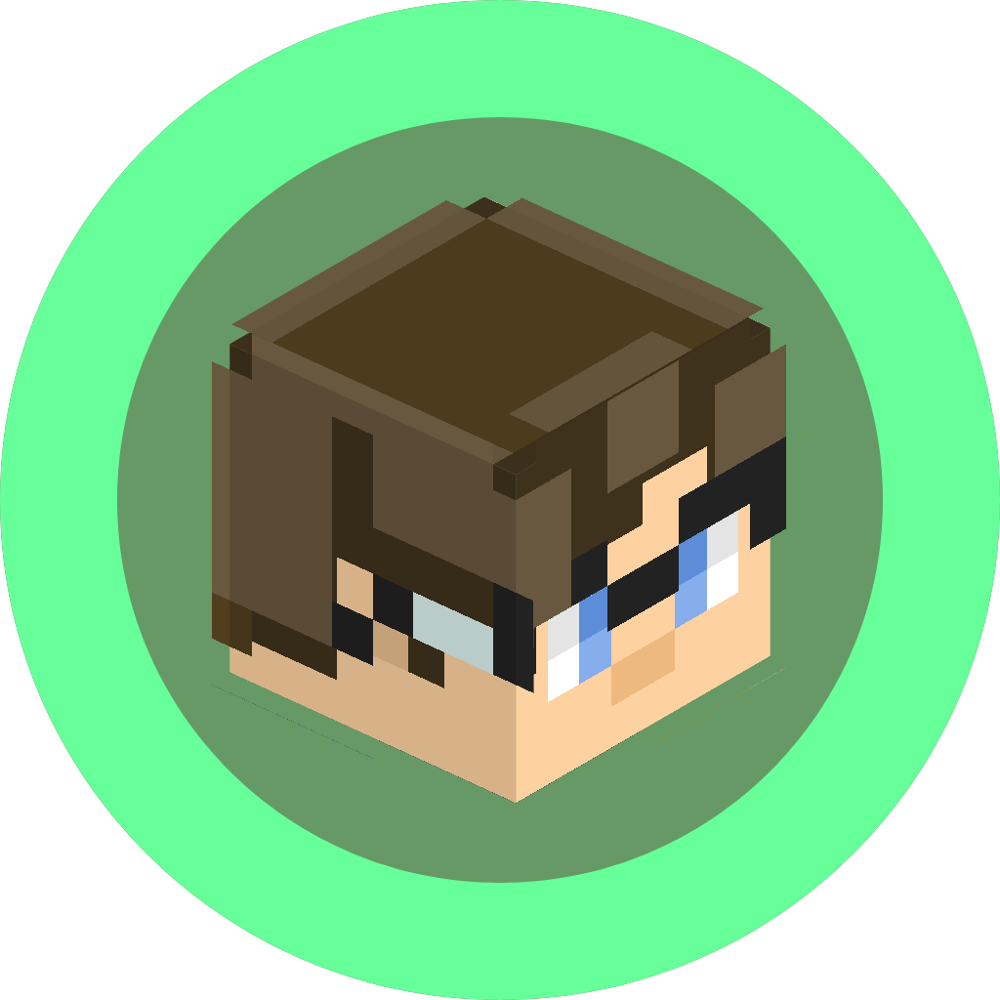

# alanthecoderishere 👋

### 👨‍💻 Founder & Lead Developer @ JavaFabulous Studios
I specialize in building high-performance tools, custom game engines, and immersive Minecraft experiences with a focus on low-end PC optimization.

---

### 🏢 Studio Profile: JavaFabulous Studios
As the founder of an indie game studio, I oversee the development of several key projects, focusing on technical innovation and minimalist design.

- **Active Projects:** Rubytale (v1.26.9), MiniVenture, and the Fireworks Engine.
- **Vision:** Delivering smooth gaming experiences through heavy optimization and custom-built tech stacks.

---

### 🛠️ Technical Stack & Skills

**Languages**

**Core Expertise**
- **Engine Architecture:** Java-based core logic and Minecraft modding (Fabric).
- **Web Development:** Responsive interfaces, desktop integrations, and the Alpine hub UI.
- **Graphics & Shaders:** Advanced graphics development via GLSL, focusing on PBR/POM behavior.
- **Custom Tech:** Developing **Helium (.ium)**, a custom language for the Fireworks Engine.

---

### 🚀 Key Projects

- **🏔️ Alpine:** A minimalist Minecraft modding hub featuring Modrinth API & Discord-style community features.
- **🎆 Fireworks Engine:** A performance-first game engine built from scratch for low-end hardware.
- **💡 Real Lighting (RL):** A high-fidelity Minecraft shader project focusing on physical light behavior.

---

### 🎨 Design & Modeling

- **Aesthetics:** Specialized in minimalist **Dark Mode** interfaces with **Pastel Green** accents.
- **Tools:**
  
  
  

---

### 🌐 Community & Collaboration

- **🏰 Four Pixel (4pixel):** Founder and manager of the Superflat Anarchy Minecraft server.
- **🤝 Collaborators:** Actively working with developers like **MeisDev** and **Uoc Tamika**.

---

### 📈 GitHub Stats

---

  

